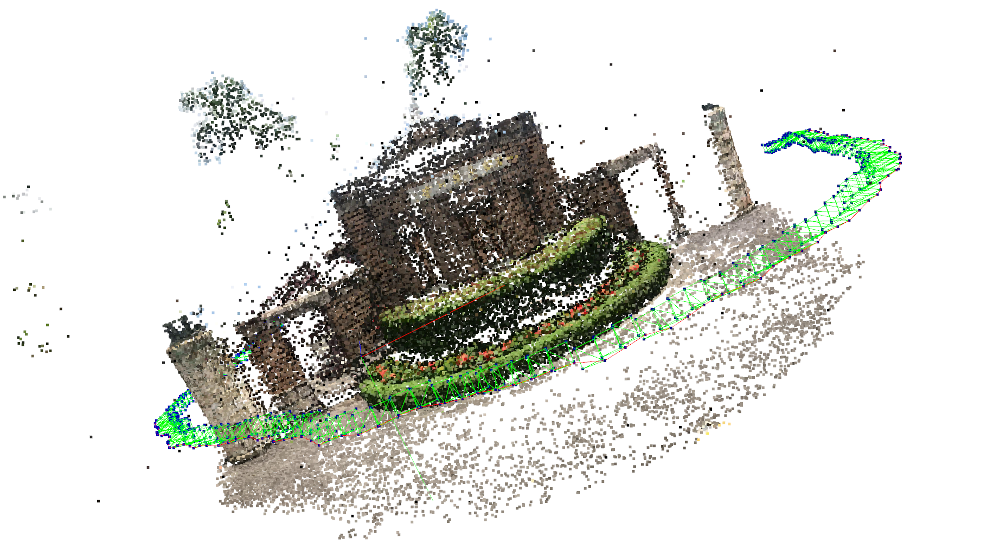
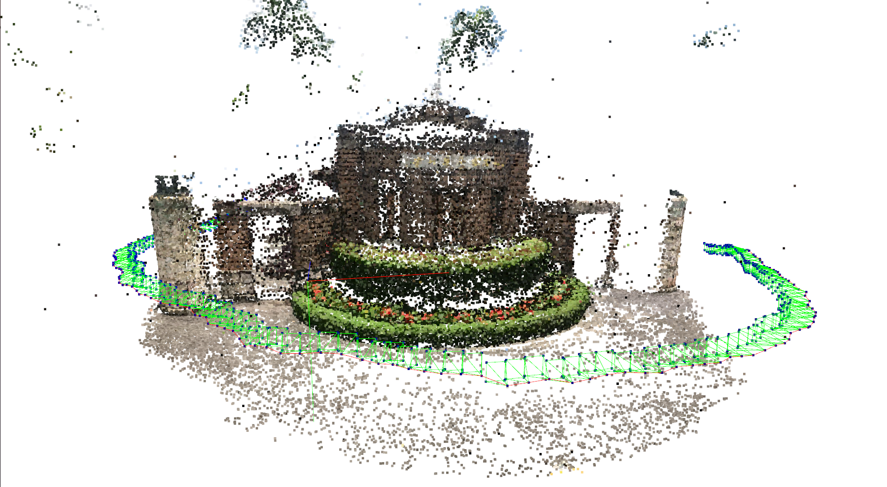
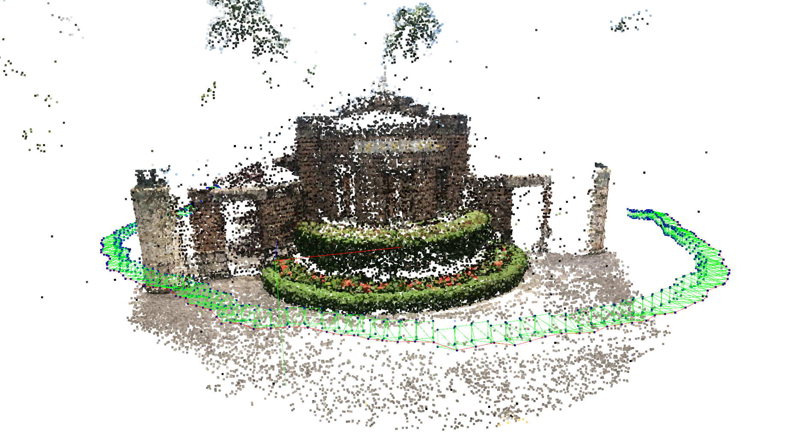
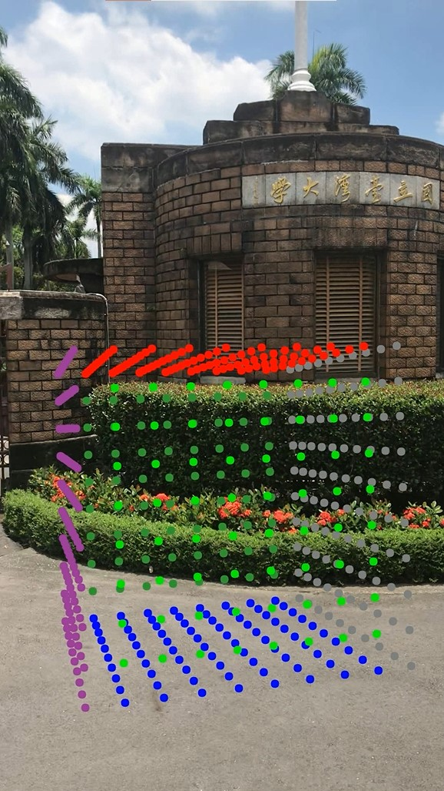
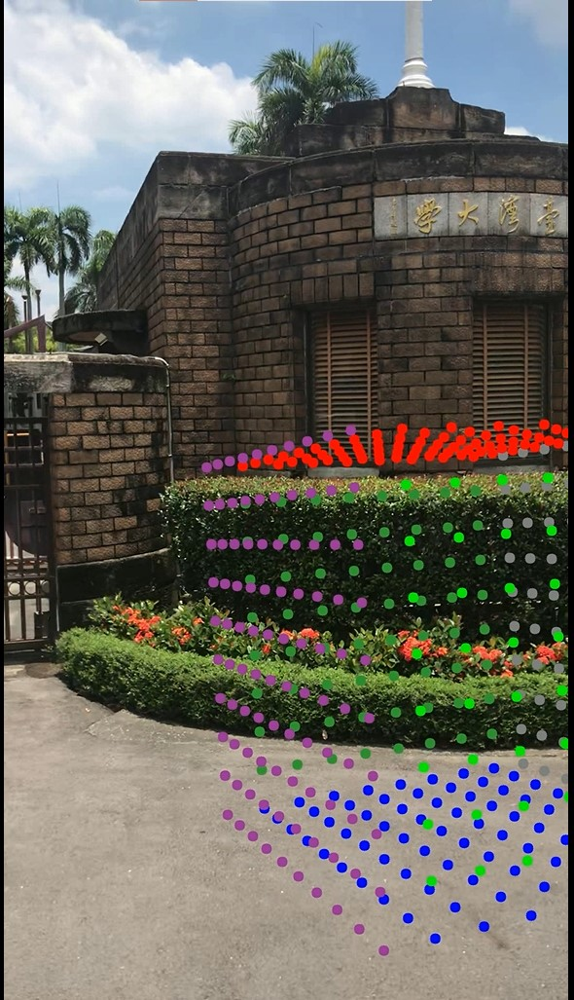

# Report - 3DCV HW2

## Problem 1
### **Q1-1** For each validation image, compute its camera pose with respect to world coordinate. Find the 2D-3D correspondence by descriptor matching, and solve the camera pose. Implement at least one kind of algorithm that solves a PnP problem. Briefly explain your implementation and write down the pseudo code in your report.

* Notes:
    * Expected Solution: P3P + RANSAC. You have to implement RANSAC by yourself.
    * You cannot use calib3d module in OpenCV. That is, solvePnP and solvePnPRansac is forbidden. However, you are encouraged to try them beforehand.
    * You may also try DLT, EPnP, AP3P, or any kinds of solutions.
    
* Implement
    * get points3D and undistort Points2D
    * ransec
        1. random choose 3 points
        2. get T and R by p3p solver
        3. get n_inliers
        4. choose T and R with the most of inliers
    * p3p
        1. undistort points2D
        2. compute G, K to solve other parameters
        3. solve side with length and cos(angle)
        4. solve T by trilateration
        5. solve X - T
        6. solve lambda among Ts
        7. solve R among lambdas and Ts
        8. check det and orthogonal
        9. select best T and R with distance
    * pseudo
    
    ```
    points2D, points3D <- get_correspondences()
    n_ransec_time <- log(1 - p) / log(1 - (1 - e) ^ s)
    R_T_records = []
    for 1 .. n_ransec_time
        (points2D_sample, points3D_sample, points2D_valid, points3D_valid) <- (random_choice(points2D, points3D))
        points2D_sample <- undistort(points2D_sample)
        cosines <- get_cosine(points2D_sample)
        distances <- get_distances(points3D_sample)
        solve_sides(cosines, distances) <- solve_G(cosines, distances), solve_K(cosines, distances)
        sides <- solve_sides(cosines, distances)
        T <- trilateration(points3D_sample, sides)
        lambdas <- distance(points3D_sample, T) / distance(points2D_sample, origin)
        R <- (lambda * points2D_sample) @ inverse(points3D_sample - T)
        check_det(R)
        check_orthogonal(R)
        best_R, best_T, inliers <- select_R_T(Ts, Rs, points2D_valid, points3D_valid)
        R_T_records.append(best_R, best_T, inliers)
    R, T <- select_RANSAC(R_T_records)
    ```
### **Q1-2** For each camera pose you calculated, compute the median pose error (translation, rotation) with respect to ground truth camera pose. Provide some discussion.

* Notes:
    * Translation: median of all absolute pose differences (Euclidean Distance).
      
    * Rotation: median of relative rotation angle between estimation and ground-truth.
        1. Find out the relative rotation and represent it as axis angle representation.
        2. Report the median of angles.)
    
* Error Result
    * T = 0.0032170307685774474
    * angle = 0.0009320215981229483
    
* Implement
    * ` python p1.py` or ` python p1-12.py`
    1. Get camera pose groudtruth
    2. Given T and R
    3. transform R angle representation
    4. compare with ground truth to get error

* Discussion
    * validation points more -> RANSAC more iteration -> preciser
    * error rate higher -> RANSAC more iteration -> preciser
    * probability higher -> RANSAC more iteration -> preciser
    * distance (thresold) too strict or too loose may worsen performance
    * undistortion can help increasing performance

### **Q1-3** For each camera pose you calculated, plot the trajectory and camera poses along with 3d point cloud model using Open3D. Explain how you draw and provide some discussion.

* Notes:
    * Draw the camera pose as a quadrangular pyramid, where the apex is the position of the optical center, and the normal of base is the bearing (orientation) of the camera.
    
* Result

    
    
    
    
    

* Implement
    * ` python p1.py` or ` python p1-12.py`
    1. project origin 2D points to camera center 3D
    2. given length of distance to camera center and width of image plane
    3. project 4 points projection to WCS image plane
    4. get camera pose
    5. get trajectory
    
## Problem2
### **Q2-1** With camera intrinsic and extrinsic parameters, place a virtual cube in the the validation image sequences to create an Augmented Reality video. Draw the virtual cube as a point set with different colors on its surface. Implement a simply but efficient painter’s algorithm to determine the order of drawing.

* Notes:
    * You don’t have to consider whether virtual cube will be occluded.
    * Manually select the location, orientation, and scale of the virtual cube. (We provide a code that allows you to adjust the cube by keyboard.)
    * Painter’s Algorithm:
        1. Sort each voxel by depth
        2. Place each voxel from the furthest to the closest
    
* Result
    * AR.gif or AR.mp4
    
    
    
    
    
    
    
* implement
    1. Construct points in 6 surfaces in WCS
    2. Construct class to keep each point information (position, color, etc.)
    3. project WCS points3D to points2D among points
    4. sort with distance (depth) to optical center
    5. draw far points first
    6. plot with open3D
    7. output to video


## Environment
* python 3.9.7
* open3d 
* numpy 
* opencv-python 
* scipy 
* pandas
* tqdm 
* imageio

## usage

### implement on problem 1
```
python p1.py
```
### implement on problem 2
```bash
python p2.py
```
