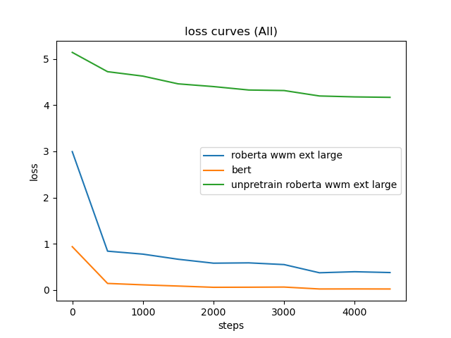
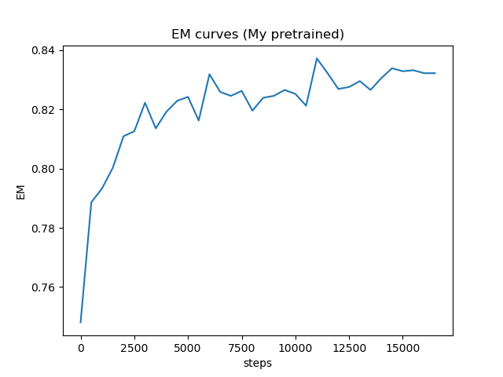

# Report - ADL HW2
## Q1: Data processing

1. Tokenizer: 

    * a. Describe in detail about the tokenization algorithm you use. You need to explain what it does in your own ways.
    
        Bert tokenizer, word piece, is a processing method similar to byte pair encoding. It splits words into baskets of subwords to help processing previously unseen word. Moreover, it maybe helpful to consider the relationship between some structurally similar words, such as the same root or the same prefix, like go and goes. The main difference between BPE and wordpiece is that the former selects the subword with the highest frequency, while the latter chooses the subword according to the maximum probability, and its algorithm is as follows.
        
        * Step 1: Define vocabulary size.
        * Step 2: Split the word into baskets of subwords or characters.
        * Step 3: Build a language model based on the data generated in Step 2.
        * Step 4: Select the subword which increase the likelihood most.
        * Step 5: Repeat Step 4 until the threshold is reached
        
2. Answer Span:
 
    * a. How did you convert the answer span start/end position on characters to position on tokens after BERT tokenization?
    
        Tokenizer can choose return_offsets_mapping to return the char start and char end corresponding to each token. start position is the value when span start and char start are the same, we can find the same value by iteration. In a similar way, we can find the end position by iteratively comparing span start and char start. When the same value occurs, it's just the value at the end position.
        
    * b. After your model predicts the probability of answer span start/end position, what rules did you apply to determine the final start/end position?

        Multiply each start and end pair or add the pair for which no exponent is applied, and remove some pairs that don't match qualification, such as subsentence being longer than sentence or end position being smaller than start position. Then the result is the most likely pairs. 

## Q2: Modeling with BERTs and their variants
1. Describe
    * a. your model (configuration of the transformer model)
        * bert-base
            * context-selection
            ``` 
            {
              "_name_or_path": "bert-base-chinese",
              "architectures": [
                "BertForMultipleChoice"
              ],
              "attention_probs_dropout_prob": 0.1,
              "classifier_dropout": null,
              "directionality": "bidi",
              "hidden_act": "gelu",
              "hidden_dropout_prob": 0.1,
              "hidden_size": 768,
              "initializer_range": 0.02,
              "intermediate_size": 3072,
              "layer_norm_eps": 1e-12,
              "max_position_embeddings": 512,
              "model_type": "bert",
              "num_attention_heads": 12,
              "num_hidden_layers": 12,
              "pad_token_id": 0,
              "pooler_fc_size": 768,
              "pooler_num_attention_heads": 12,
              "pooler_num_fc_layers": 3,
              "pooler_size_per_head": 128,
              "pooler_type": "first_token_transform",
              "position_embedding_type": "absolute",
              "torch_dtype": "float32",
              "transformers_version": "4.24.0",
              "type_vocab_size": 2,
              "use_cache": true,
              "vocab_size": 21128
            } 
            ```
            
            * question-answering
            ```
            {
              "_name_or_path": "bert-base-chinese",
              "architectures": [
                "BertForQuestionAnswering"
              ],
              "attention_probs_dropout_prob": 0.1,
              "classifier_dropout": null,
              "directionality": "bidi",
              "hidden_act": "gelu",
              "hidden_dropout_prob": 0.1,
              "hidden_size": 768,
              "initializer_range": 0.02,
              "intermediate_size": 3072,
              "layer_norm_eps": 1e-12,
              "max_position_embeddings": 512,
              "model_type": "bert",
              "num_attention_heads": 12,
              "num_hidden_layers": 12,
              "pad_token_id": 0,
              "pooler_fc_size": 768,
              "pooler_num_attention_heads": 12,
              "pooler_num_fc_layers": 3,
              "pooler_size_per_head": 128,
              "pooler_type": "first_token_transform",
              "position_embedding_type": "absolute",
              "torch_dtype": "float32",
              "transformers_version": "4.24.0",
              "type_vocab_size": 2,
              "use_cache": true,
              "vocab_size": 21128
            }
            ```
    * b. performance of your model.
        * Context selection accuracy: 0.9631106853485107
        * Question answering EM: 0.77868
        
    * c. the loss function you used.
        * Cross Entropy Loss
        
    * d. The optimization algorithm (e.g. Adam), learning rate and batch size.
        * context-selection
            * optimization: AdamW (lr=3e-5)
            * lr scheduler with warmup
            * warmup ratio: 0.1
            * batch size: 8
            * gradient accumulation step: 2
            
        * question-answering
            * optimization: AdamW (lr=3e-5)
            * lr scheduler with warmup
            * warmup ratio: 0.1
            * batch size: 8
            * gradient accumulation step: 2

1. Try another type of pretrained model and describe
    * a. your model
         * roberta-wwm-ext-large
             * context-selection
            ```
            {
            "_name_or_path": "hfl/chinese-roberta-wwm-ext-large",
            "architectures": [
            "BertForMultipleChoice"
            ],
            "attention_probs_dropout_prob": 0.1,
            "bos_token_id": 0,
            "classifier_dropout": null,
            "directionality": "bidi",
            "eos_token_id": 2,
            "hidden_act": "gelu",
            "hidden_dropout_prob": 0.1,
            "hidden_size": 1024,
            "initializer_range": 0.02,
            "intermediate_size": 4096,
            "layer_norm_eps": 1e-12,
            "max_position_embeddings": 512,
            "model_type": "bert",
            "num_attention_heads": 16,
            "num_hidden_layers": 24,
            "output_past": true,
            "pad_token_id": 0,
            "pooler_fc_size": 768,
            "pooler_num_attention_heads": 12,
            "pooler_num_fc_layers": 3,
            "pooler_size_per_head": 128,
            "pooler_type": "first_token_transform",
            "position_embedding_type": "absolute",
            "torch_dtype": "float32",
            "transformers_version": "4.24.0",
            "type_vocab_size": 2,
            "use_cache": true,
            "vocab_size": 21128
            }
            ```
            
            * question-answering
            ```
            {
              "_name_or_path": "hfl/chinese-roberta-wwm-ext-large",
              "architectures": [
                "BertForQuestionAnswering"
              ],
              "attention_probs_dropout_prob": 0.1,
              "bos_token_id": 0,
              "classifier_dropout": null,
              "directionality": "bidi",
              "eos_token_id": 2,
              "hidden_act": "gelu",
              "hidden_dropout_prob": 0.1,
              "hidden_size": 1024,
              "initializer_range": 0.02,
              "intermediate_size": 4096,
              "layer_norm_eps": 1e-12,
              "max_position_embeddings": 512,
              "model_type": "bert",
              "num_attention_heads": 16,
              "num_hidden_layers": 24,
              "output_past": true,
              "pad_token_id": 0,
              "pooler_fc_size": 768,
              "pooler_num_attention_heads": 12,
              "pooler_num_fc_layers": 3,
              "pooler_size_per_head": 128,
              "pooler_type": "first_token_transform",
              "position_embedding_type": "absolute",
              "torch_dtype": "float32",
              "transformers_version": "4.24.0",
              "type_vocab_size": 2,
              "use_cache": true,
              "vocab_size": 21128
            }
            ```
            
    * b. performance of your model.
        * Context selection accuracy: 0.9654369950294495
        * Question answering EM: 0.81916
    
    * c. the difference between pretrained model (architecture, pretraining loss, etc.)
        * The main difference is the dynamic mask, BERT does not change the mask position after being defined during pre-training, while RoBERTa dynamically modifies the mask position over a period of time. Furthermore, whole word masking change the way to mask subword. Originally, if the subword is masked, the entire corresponding word should also be masked. For Chinese, since the smallest unit of a word is character, it will be processed with pre-trained word segmentation, tokenization, and subword models before masking. Then, if a character is masked, the entire corresponding word should also be masked.
        * The main model difference: RoBERTa attention_heads and num_hidden_layers becomes more than BERT.

    * d. For example, BERT -> xlnet, or BERT -> BERT-wwm-ext. You can find these models in huggingface’s Model Hub.
        * BERT -> roberta-wwm-ext-large

## Q3: Curves
1. Plot the learning curve of your QA model
    * a. Learning curve of loss 

        My pretrained

    
    
        All

    

    * b. Learning curve of EM 

        My pretrained

    
    
        All

    

## Q4: Pretrained vs Not Pretrained
* Train a transformer model from scratch (without pretrained weights) on the dataset (you can choose either MC or QA)
* Describe
    * The configuration of the model and how do you train this model
        * roberta-wwm-ext-large
             * context-selection
            ```
            {
            "_name_or_path": "hfl/chinese-roberta-wwm-ext-large",
            "architectures": [
            "BertForMultipleChoice"
            ],
            "attention_probs_dropout_prob": 0.1,
            "bos_token_id": 0,
            "classifier_dropout": null,
            "directionality": "bidi",
            "eos_token_id": 2,
            "hidden_act": "gelu",
            "hidden_dropout_prob": 0.1,
            "hidden_size": 1024,
            "initializer_range": 0.02,
            "intermediate_size": 4096,
            "layer_norm_eps": 1e-12,
            "max_position_embeddings": 512,
            "model_type": "bert",
            "num_attention_heads": 16,
            "num_hidden_layers": 24,
            "output_past": true,
            "pad_token_id": 0,
            "pooler_fc_size": 768,
            "pooler_num_attention_heads": 12,
            "pooler_num_fc_layers": 3,
            "pooler_size_per_head": 128,
            "pooler_type": "first_token_transform",
            "position_embedding_type": "absolute",
            "torch_dtype": "float32",
            "transformers_version": "4.24.0",
            "type_vocab_size": 2,
            "use_cache": true,
            "vocab_size": 21128
            }
            ```
            
            * question-answering
            ```
            {
              "_name_or_path": "hfl/chinese-roberta-wwm-ext-large",
              "architectures": [
                "BertForQuestionAnswering"
              ],
              "attention_probs_dropout_prob": 0.1,
              "bos_token_id": 0,
              "classifier_dropout": null,
              "directionality": "bidi",
              "eos_token_id": 2,
              "hidden_act": "gelu",
              "hidden_dropout_prob": 0.1,
              "hidden_size": 1024,
              "initializer_range": 0.02,
              "intermediate_size": 4096,
              "layer_norm_eps": 1e-12,
              "max_position_embeddings": 512,
              "model_type": "bert",
              "num_attention_heads": 16,
              "num_hidden_layers": 24,
              "output_past": true,
              "pad_token_id": 0,
              "pooler_fc_size": 768,
              "pooler_num_attention_heads": 12,
              "pooler_num_fc_layers": 3,
              "pooler_size_per_head": 128,
              "pooler_type": "first_token_transform",
              "position_embedding_type": "absolute",
              "torch_dtype": "float32",
              "transformers_version": "4.24.0",
              "type_vocab_size": 2,
              "use_cache": true,
              "vocab_size": 21128
            }
            ```
        * The code different part from pretrain 
        ```
        # pretrain weight:
        model = AutoModelForMultipleChoice.from_pretrained(
            model_args.model_name_or_path,
            from_tf=bool(".ckpt" in model_args.model_name_or_path),
            config=config,
            cache_dir=model_args.cache_dir,
            revision=model_args.model_revision,
            use_auth_token=True if model_args.use_auth_token else None,
        )

        model = AutoModelForQuestionAnswering.from_pretrained(
            model_args.model_name_or_path,
            from_tf=bool(".ckpt" in model_args.model_name_or_path),
            config=config,
            cache_dir=model_args.cache_dir,
            revision=model_args.model_revision,
            use_auth_token=True if model_args.use_auth_token else None,
        )

        # not pretrained
        model = AutoModelForMultipleChoice.from_config(
            config=config,
        )

        model = AutoModelForQuestionAnswering.from_config(
            config=config,
        )
        ```
            
    * the performance of this model v.s. BERT

        Model                                               | Context selection accuracy | Question answering EM |
        | ------------------------------------------------- | -------------------------- | --------------------- |
        | not pretrained roberta-wwm-ext-large (this model) | 0.24327018857002258        | 0.059155865736124955  | 
        | BERT                                              | 0.9631106853485107         | 0.77868               | 

        * not pretrained roberta-wwm-ext-large (this model)
            * Context selection accuracy: 0.24327018857002258
            * Question answering EM: 0.059155865736124955
        
        * BERT
            * Context selection accuracy: 0.9631106853485107
            * Question answering EM: 0.77868

    * Comparison
        * It takes longer time for training to decrease loss. In addition, since the architecture of Transformer is too huge and considers too much long-term information, it is easy to overfit when there is not enough data and requires a lot of time to train.

* Hint: you can use the same training script for this problem, just skip the part where you load the pretrained weights
* Hint: the model size configuration for BERT might be too large for this problem, if you find it hard to train a model of the same size, try to reduce model size (num_layers, hidden_dim, num_heads). Remember to report the model configuration.