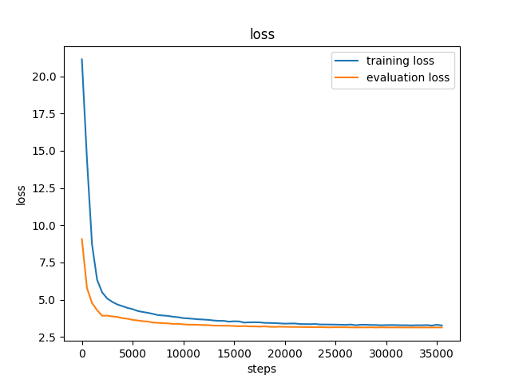
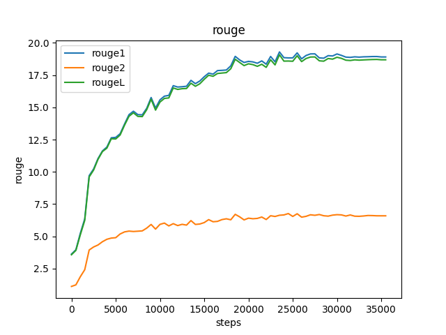

# Report - ADL HW3
## Q1: Model

* Model: 

    * Describe the model architecture and how it works on text summarization.
    ```
    {
      "_name_or_path": "google/mt5-small",
      "architectures": [
        "MT5ForConditionalGeneration"
      ],
      "d_ff": 1024,
      "d_kv": 64,
      "d_model": 512,
      "decoder_start_token_id": 0,
      "dense_act_fn": "gelu_new",
      "dropout_rate": 0.1,
      "eos_token_id": 1,
      "feed_forward_proj": "gated-gelu",
      "initializer_factor": 1.0,
      "is_encoder_decoder": true,
      "is_gated_act": true,
      "layer_norm_epsilon": 1e-06,
      "model_type": "mt5",
      "num_decoder_layers": 8,
      "num_heads": 6,
      "num_layers": 8,
      "pad_token_id": 0,
      "relative_attention_max_distance": 128,
      "relative_attention_num_buckets": 32,
      "tie_word_embeddings": false,
      "tokenizer_class": "T5Tokenizer",
      "torch_dtype": "float32",
      "transformers_version": "4.24.0",
      "use_cache": true,
      "vocab_size": 250112
    }
    ```
    
* Preprocessing
 
    * Describe your preprocessing (e.g. tokenization, data cleaning and etc.)
        * tokenizer
        ```
        {
          "additional_special_tokens": null,
          "eos_token": "</s>",
          "extra_ids": 0,
          "name_or_path": "google/mt5-small",
          "pad_token": "<pad>",
          "sp_model_kwargs": {},
          "special_tokens_map_file": "./cache/models--google--mt5-small/snapshots/f03a52d3eaa650878b6f52e443bc4d5b385e786e/special_tokens_map.json",
          "tokenizer_class": "T5Tokenizer",
          "unk_token": "<unk>"
        }
        ```
        
## Q2: Training
* Hyperparameter
    * Describe your hyperparameter you use and how you decide it.
    ```
    (
        _n_gpu=0,
        adafactor=False,
        adam_beta1=0.9,
        adam_beta2=0.999,
        adam_epsilon=1e-08,
        auto_find_batch_size=False,
        bf16=False,
        bf16_full_eval=False,
        data_seed=888,
        dataloader_drop_last=False,
        dataloader_num_workers=0,
        dataloader_pin_memory=True,
        ddp_bucket_cap_mb=None,
        ddp_find_unused_parameters=None,
        ddp_timeout=1800,
        debug=[],
        deepspeed=None,
        disable_tqdm=False,
        do_eval=True,
        do_predict=True,
        do_train=True,
        eval_accumulation_steps=None,
        eval_delay=0,
        eval_steps=500,
        evaluation_strategy=steps,
        fp16=False,
        fp16_backend=auto,
        fp16_full_eval=False,
        fp16_opt_level=O1,
        fsdp=[],
        fsdp_min_num_params=0,
        fsdp_transformer_layer_cls_to_wrap=None,
        full_determinism=False,
        generation_max_length=None,
        generation_num_beams=5,
        gradient_accumulation_steps=1,
        gradient_checkpointing=False,
        greater_is_better=None,
        group_by_length=False,
        half_precision_backend=auto,
        hub_model_id=None,
        hub_private_repo=False,
        hub_strategy=every_save,
        hub_token=<HUB_TOKEN>,
        ignore_data_skip=False,
        include_inputs_for_metrics=False,
        jit_mode_eval=False,
        label_names=None,
        label_smoothing_factor=0.0,
        learning_rate=3e-05,
        length_column_name=length,
        load_best_model_at_end=False,
        local_rank=-1,
        log_level=passive,
        log_level_replica=passive,
        log_on_each_node=True,
        logging_dir=./model888/runs/Nov30_16-53-03_maomao-workplace,
        logging_first_step=False,
        logging_nan_inf_filter=True,
        logging_steps=500,
        logging_strategy=steps,
        lr_scheduler_type=cosine,
        max_grad_norm=1.0,
        max_steps=-1,
        metric_for_best_model=None,
        mp_parameters=,
        no_cuda=False,
        num_train_epochs=20.0,
        optim=adamw_hf,
        output_dir=./model888,
        overwrite_output_dir=True,
        past_index=-1,
        per_device_eval_batch_size=12,
        per_device_train_batch_size=12,
        predict_with_generate=True,
        prediction_loss_only=False,
        push_to_hub=False,
        push_to_hub_model_id=None,
        push_to_hub_organization=None,
        push_to_hub_token=<PUSH_TO_HUB_TOKEN>,
        ray_scope=last,
        remove_unused_columns=True,
        report_to=['tensorboard'],
        resume_from_checkpoint=None,
        run_name=./model888,
        save_on_each_node=False,
        save_steps=500,
        save_strategy=steps,
        save_total_limit=None,
        seed=888,
        sharded_ddp=[],
        skip_memory_metrics=True,
        sortish_sampler=False,
        tf32=None,
        torchdynamo=None,
        tpu_metrics_debug=False,
        tpu_num_cores=None,
        use_ipex=False,
        use_legacy_prediction_loop=False,
        use_mps_device=False,
        warmup_ratio=0.2,
        warmup_steps=0,
        weight_decay=0.0,
        xpu_backend=None,
    )
    ```
        
* Learning Curves
    * Plot the learning curves (ROUGE versus training steps)
        * loss

        
        
        * rouge

        

## Q3: Generation Strategies
* Stratgies
    * Describe the detail of the following generation strategies:
        * Greedy
            * Greedy search simply selects the word with the highest probability as its next word: $w_t = argmax_{w}P(w | w_{1:t-1})$ at each timestep tt. The following sketch shows greedy search.
            
        * Beam Search
            * Beam search reduces the risk of missing hidden high probability word sequences by keeping the most likely num_beams of hypotheses at each time step and eventually choosing the hypothesis that has the overall highest probability.
            
        * Top-k Sampling
            * Randomly picking the next word $w_t$ from the K most likely next words are filtered and the probability mass is redistributed among only those K next words.
            
        * Top-p Sampling
            * Randomly choosing the next word $w_t$ from the smallest possible set of words whose cumulative probability exceeds the probability p. The probability mass is then redistributed among this set of words. This way, the size of the set of words (a.k.a the number of words in the set) can dynamically increase and decrease according to the next word's probability distribution.
            
        * Temperature
            * The value used to module the next token probabilities.
            * The models often generate incoherent gibberish. A trick is to make the distribution $P(w|w_{1:t-1})$ sharper (increasing the likelihood of high probability words and decreasing the likelihood of low probability words) by lowering the so-called temperature of the softmax.

* Hyperparameters
    * Try at least 2 settings of each strategies and compare the result. 
        
        * Greedy vs Sample
        
        | Method | rouge-1             | rouge-2             | rouge-L                         |
        | ------ | ------------------- |  -------------------| ------------------------------ |
        | Greedy | 0.24765091796668157 | 0.09325315274046804 | 0.22163141885771145 |
        | Sample | 0.19222248815848966 | 0.06275175977187429 | 0.17017046774463196 |
        
        * Beam Search

        | beam size  | rouge-1             | rouge-2             | rouge-L                         |
        | ---------- | ------------------- |  -------------------| -------------------------- |
        | 1 (Greedy) | 0.24765091796668157 | 0.09325315274046804 | 0.22163141885771145 |
        | 5          | 0.25816324729042595 | 0.10386985944414036 | 0.2306351931010823  |
        | 10         | 0.25706684160817134 | 0.10429584872199674 | 0.22961144129951208 |
        
        * Top-k Sampling

        | Top-k | rouge-1             | rouge-2             | rouge-L                         |
        | ----- | ------------------- |  -------------------| ------------------------------- |
        | 0     | 0.1478340727948164  | 0.04465323492673004 | 0.13237477719776036 |
        | 5     | 0.22660578311227525 | 0.10386985944414036 | 0.20075789146521852 |
        | 10    | 0.21746560833959294 | 0.07444877967890173 | 0.19295929444195561 |
        
        * Top-p Sampling

        | Top-p | rouge-1             | rouge-2             | rouge-L                         |
        | ----- | ------------------- |  -------------------| ------------------------------- |
        | 0.8   | 0.2169161028131528  | 0.07449239151428416 | 0.19234825346791348 |
        | 0.9   | 0.20664634851490904 | 0.06939106963720426 | 0.1840207283142242  |
        
        * Temperature

        | Temperature | rouge-1             | rouge-2             | rouge-L                         |
        | ----------- | ------------------- |  -------------------| ------------------------------- |
        | 0.7         | 0.2223929344694026  | 0.07837742993826312 | 0.19805251961577555 |
        | 0.8         | 0.21362761333743993 | 0.07367298911661009 | 0.18947450648030603 |
        
    * What is your final generation strategy? (you can combine any of them)
        * beam size = 5