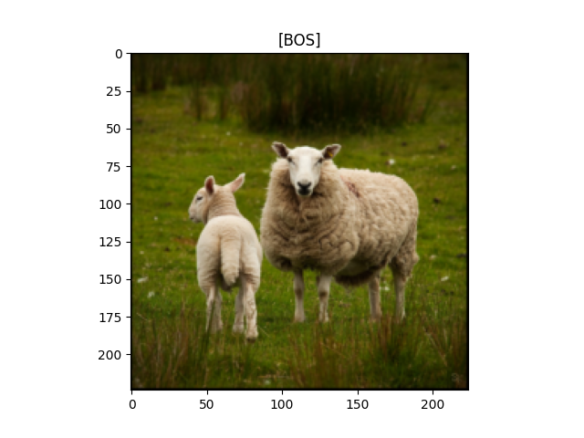
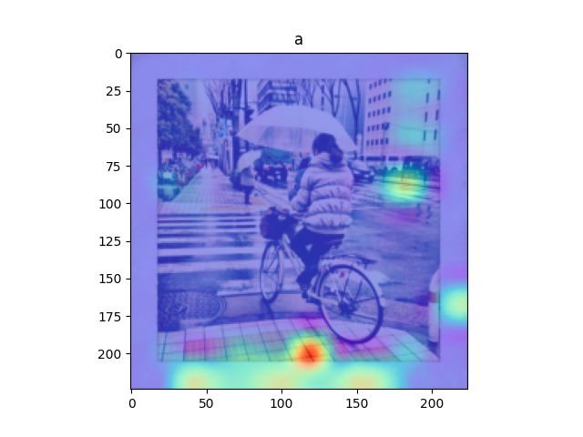
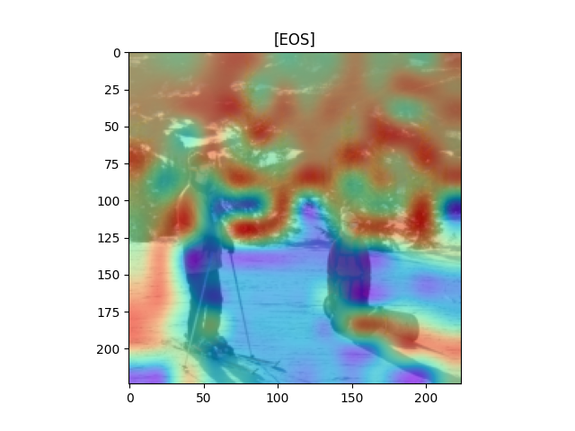
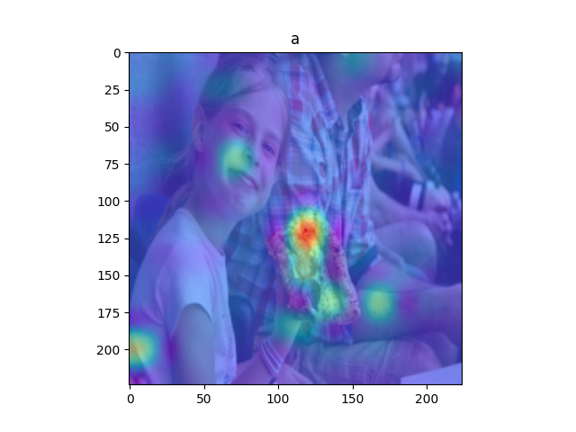

# Report - DLCV HW3
## Problem 1
1. Methods analysis
    * Previous methods (e.g. VGG and ResNet) are good at one task and one task only, and requires significant efforts to adapt to a new task. Please explain why CLIP could achieve competitive zero-shot performance on a great variety of image classification datasets.
    
      因為CLIP在整個空間中，把相同的image和text放在空間中附近的位置，這樣下游的task需要使用image或是text的時候，就會很好的取得同label的東西。在一般的model中，只會依據task進行最有效率的domain劃分，但不會是general的。而CLIP則是盡量讓同類在一群，不會太在乎不同群一定要分多開，且一般的model通常只有image或text，而CLIP是都有。
    
2. Prompt-text analysis
    * Compare and discuss the performances of your model: 
        1. "This is a photo of {object}": 71.24%
        2. "This is a {object} image.": 68.24%
        3. "No {object}, no score.": 56.20%
    
3. Quantitative analysis
    * Sample three images from the validation dataset and then visualize the probability of the top-5 similarity scores:

    

    

    

## Problem 2
1. Report your best setting and its corresponding CIDEr & CLIPScore on the validation data.
    * setting
        * ViT model: timm vit_large_patch16_224
            * unfreeze
        * n_layers: 7 (the number of decoder layers)
        * d_model: 1024 (the dimension of text embedding)
        * d_ff: 2048 (the dimension of feed forward)
        * n_heads: 8 (the number of head for attention)
        * dropout: 0.1 (the dropout of model)
        * learning rate: 5e-5
    * CIDEr & CLIPScore
        * CIDEr: 0.2201978681717357
        * CLIPScore: 0.5020997936063268
    
2. Report other 3 different attempts (e.g. pretrain or not, model architecture, freezing layers, decoding strategy, etc.) and their corresponding CIDEr & CLIPScore.
    * attempt 1
        * setting
            * ViT model: freeze
            * n_layers: 6 (the number of decoder layers)
            * learning rate: 3e-5
        * CIDEr & CLIPScore
            * CIDEr: 0.1445053797064114
            * CLIPScore: 0.46418003958653575
    * attempt 2
        * setting
            * ViT model: unfreeze
            * n_layers: 8 (the number of decoder layers)
            * learning rate: 3e-5
        * CIDEr & CLIPScore
            * CIDEr: 0.18651525828635146
            * CLIPScore: 0.49165882432574065
    * attempt 3
        * setting
            * ViT model: unfreeze
            * n_layers: 9 (the number of decoder layers)
            * learning rate: 3e-5
        * CIDEr & CLIPScore
            * CIDEr: 0.08975690550254119 
            * CLIPScore: 0.46795814646363193
## Problem 3
1. Visualize the predicted caption and the corresponding series of attention maps

    * sheep

        

        

        

        

        

        

        

        

        

        

        

    * bike

        

        

        

        

        

        

        

        

        

        

        

        

        

        

        

        

        

        

    * people

        

        

        

        

        

        

        

        

        

        

        

        

        

    * rain

        

        

        

        

        

        

        

        

        

        

        

        

    * eat

        

        

        

        

        

        

        

        

2. According to CLIPScore, visualize the followings in the validation dataset of problem 2.
    1. top-1 and last-1 image-caption pairs
    2. its corresponding CLIPScore  

    * a
        1. image

            

            

        2. 0.5020997936063268

    * b
        1. image

            

            

        2. 0.4985997923063268
        
    * c
        1. image

            

            

        2. 0.4844448536063268
        
3. Analyze the predicted captions and the attention maps for each word according to the previous question. Is the caption reasonable? Does the attended region reflect the corresponding word in the caption?

    reasonable, 

    yes, you can find higher score with great map