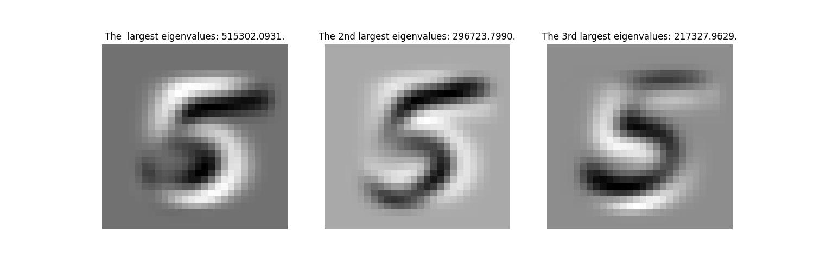

# DSP_Dimension_Reduction

## Q1: Show the mean of all 70,000 images.


## Q2: Extract all the “5” images (6313 vectors). Use centered PCA (5's center) to decompose. Show the eigenvectors with the three largest  eigenvalues. Show the corresponding eigenvalues as well.


## Q3: Extract all the “5” images. Use centered PCA and the top {3,10,30,100} eigenvectors to reconstruct the first “5” image. Explain your results.
As we increase the number of bases used for reconstruction, the time required also increases. Furthermore, the quality of the result improves, bringing us closer to the original image. Since it has the ability to encompass more complex spatial dimensions.


## Q4: Extract the first 10,000 images. Next, extract all the “1”, “3”, and "6" (from the 10,000 images). Use centered PCA ([1,3,6]'s center) to reduce the dimension from 784 to 2 (the two largest eigenvalues). Plot those points in a 2-D plane using plt.scatter function with different colors. Explain your results.
It is noticeable that points of the same color tend to form clusters, as they share similar semantics and shapes. That is, when using important features, the points with different labels tend to be far from each other.


## Q5: Define the first 10,000 images as training set. Find the 5 bases of the #10001 image ("3") with sparsity = 5. Show the 5 bases. What do you observe?
Despite our intention to generate the digit '3', we get the digit '7' in the final bases. One possible explanation is that the initial three bases effectively capture the majority of features associated with '3', while the inclusion of '7' in subsequent bases helps to refine or compensate for certain missing features.


## Q6: Define the first 10,000 images as training set. Find the bases of the #10002 image ("8") with sparsity = {5,10,40,200}. Show the reconstruction images. Calculate their reconstruction errors using L-2 norm (Euclidean distance). Explain your results.
As we increase sparsity (the number of bases) used for reconstruction, the time required also increases. Furthermore, the quality of the image improves, bringing us closer to the original image. Since it has the ability to encompass more complex spatial dimensions.


## Q7: Extract all the "8" images from the dataset (6825 vectors).
1. Use centered PCA to reconstruct the last “8”. (Remain 5 largest eigenvalues.) 
2. Use the first 6824 images as the base set. Use OMP to find the base and reconstruct the last "8". (Sparsity=5)
3. As 2, use "lasso" to find the bases and reconstruct the images.
4. Adjust the lasso parameters. Explain your experiments and results.

PCA primarily focuses on capturing the overall structure or essence of the data rather than individual components. It places more emphasis on the entirety of the data rather than specific elements. On the other hand, OMP and Lasso methods are more geared towards reconstructing individual components.

It is evident that decreasing the value of alpha has a positive effect on the reconstruction process, as the primary objective is to minimize the difference between the original image and its reconstructed versions, rather than focusing on the regularization term. Additionally, excluding the fitting intercept may lead to a reduction in errors. However, in general, the parameters of the lasso technique do not have a significant impact visually.

Furthermore, the results suggest that the Orthogonal Matching Pursuit (OMP) method yields lower errors compared to Lasso, but it may introduce more blur visually.

In conclusion, in terms of visual performance, the ranking would be as follows: PCA > Lasso > OMP.


## Bonus: Write the lasso function (handcraft) using coordinate descent. Show your code fragment in the report. Explain your implementation in the report.
```python
class LASSO():
    def __init__(self, data_matrix):
        self.data_matrix = data_matrix


    def normalized(self):
        self.data_matrix = self.data_matrix / (np.linalg.norm(self.data_matrix, axis=0))

    # Shrinks the input values towards zero based on the threshold
    def soft_threshold(self, data, threshold):
        return np.sign(data) * np.maximum(np.abs(data) - threshold, 0)
        # if data > threshold:
        #     return data - threshold
        # elif data < -threshold:
        #     return data + threshold
        # else:
        #     return 0


    def lasso_coordinate_descent(self, signal, alpha=0.1, max_iter=1000, tolerance=1e-4):
        self.normalized()
        n_features, n_samples = self.data_matrix.shape
        coef = np.zeros(n_samples)
        for _ in range(max_iter):
            prev_coef = np.copy(coef)
            # Updates the weights for each feature 
            for sample_id in range(n_samples):
                project = np.dot(self.data_matrix, coef)
                curr_project = self.data_matrix[:, sample_id] * coef[sample_id]
                # Compute the partial residuals. Residual is a kind of distance or error.
                residual = signal - (project - curr_project)
                # Compute the simple least squares coefficient of these residuals on jth predictor. 
                coef_lstsq_r = np.dot(self.data_matrix[:, sample_id], residual) / n_features
                # Update the weights Beta by soft-thresholding from residual to fix reduce the distance between 
                # signal and the difference of project and curr_project 
                coef[sample_id] = self.soft_threshold(coef_lstsq_r, alpha)
            #  Until convergence
            if np.linalg.norm(coef - prev_coef) < tolerance:
                break
        return coef


    def reconstruct(self, coef):
        return coef @ self.data_matrix.T
```

The code includes the soft_threshold() function, which applies a soft thresholding operation to shrink input values towards zero, controlled by the threshold parameter alpha. The lasso_coordinate_descent() function utilizes coordinate descent to implement the Lasso algorithm. It iteratively updates the weights for each feature by employing the soft thresholding operation until convergence is reached.

Subsequently, we employ the lasso_coordinate_descent() function to obtain sparse coefficients for the target image. These coefficients, along with the training set, are then used to reconstruct the image.

1. Compute the partial residuals. Residual is a kind of distance or error.
2. Compute the simple least squares coefficient of these residuals on jth predictor.
3. Update the weights Beta by soft-thresholding from residual to fix reduce the distance between signal and the difference of project and curr_project.

