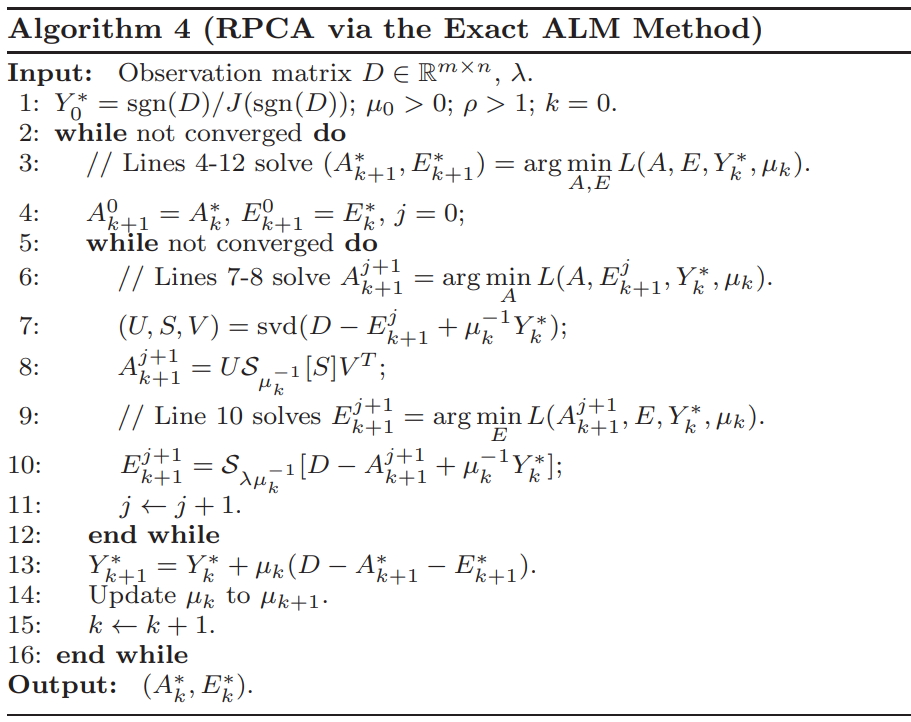
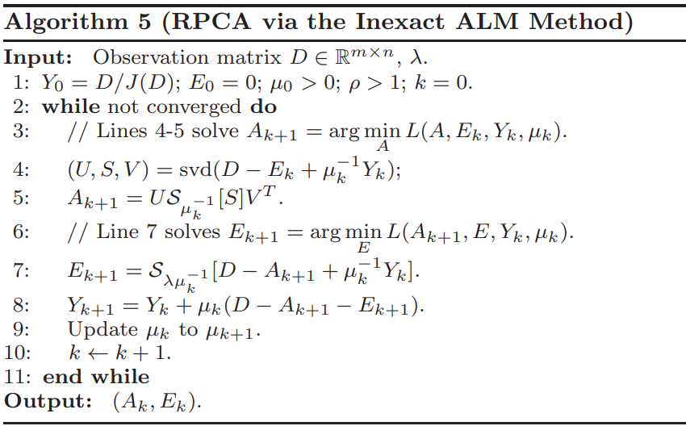

# DSP Final
## Task 1
### RPCA Algorithm
* Augmented Lagrange Multiplier (ALM)

Reference: [The Augmented Lagrange Multiplier Method for Exact Recovery of Corrupted Low-Rank Matrices](https://arxiv.org/pdf/1009.5055v3.pdf)



```python
def ALM(D, lmbda=0.01, mu=None, rho=6, sv=10., tol_inner=1e-6, tol_outer=1e-7, maxIter=1000, max_mu=1e7):
    """
    D: Data matrix
    A: Low-ramk matrix component
    E: Error matrix, Sparse component
    Y: Lagrange multiplier
    J: Dual norm
    j: Inner iteration
    k: Outer iteration
    sv: Predicted dimension
    svp:  # singular values in the sv singular values that are larger than 1 / µ
    primal_error: D - (A + E)
    """

    # Line 1 - Initialize variables
    dual_norm = J(D, lmbda)
    Y = D / dual_norm
    A_prev = np.zeros_like(Y)
    E_prev = np.zeros_like(Y)
    D_norm = np.linalg.norm(D, 'fro')
    mu = 0.5 / np.linalg.norm(np.sign(D), 2) if mu is None else mu
    d = Y.shape[1]
    # Line 2 - Line 16
    for k in range(maxIter):
        # Line 5 - Line 12
        for j in range(maxIter):
            A = A_prev
            E = E_prev
            
            # Line 7
            U, S, V = np.linalg.svd(D - E + (1 / mu) * Y, full_matrices=False)
            svp = get_svp(S, mu)
            # Line 8
            A = np.dot(np.dot(U[:, :svp], np.diag(S[:svp] - 1 / mu)), V[:svp, :])
            # Line 10
            E = soft_threshold(D - A + (1 / mu) * Y, lmbda / mu)
            sv = update_sv(sv, svp, d)

            # Check convergence
            stop_criterion_inner = ((np.linalg.norm(A - A_prev, 'fro') / D_norm) < tol_inner) or ((np.linalg.norm(E - E_prev, 'fro') / D_norm) < tol_inner)
            if stop_criterion_inner:
                break

        sv = np.min([svp + np.round(0.1 * d), d])
        # Line 13
        primal_error = D - (A + E)
        Y = Y + mu * primal_error
        # Line 14
        mu = np.min([mu * rho, max_mu])

        # Check convergence
        stop_criterion_outer = (np.linalg.norm(primal_error, 'fro') / D_norm) < tol_outer
        if stop_criterion_outer:
            break

    return A, E
```

* Inexact Augmented Lagrange Multiplier (IALM)

Reference: ChatGPT, [Robust PCA—Inexect ALM](https://www.twblogs.net/a/5bddbd2b2b717720b51abe57), [The Augmented Lagrange Multiplier Method for Exact Recovery of Corrupted Low-Rank Matrices](https://arxiv.org/pdf/1009.5055v3.pdf)



```python
def IALM(D, lmbda=0.01, mu=None,  rho=1.6, sv=10., tol=1e-7, maxIter=1000, max_mu=1e7):
    """
    D: Data matrix
    A: Low-ramk matrix component
    E: Error matrix, Sparse component
    Y: Lagrange multiplier
    J: Dual norm
    k: Iteration
    sv: Predicted dimension
    svp:  # singular values in the sv singular values that are larger than 1 / µ
    primal_error: D - (A + E)
    """

    # Line 1 - Initialize variables
    dual_norm = J(D, lmbda)
    Y = D / dual_norm
    A = np.zeros_like(Y)
    E = np.zeros_like(Y)
    D_norm = np.linalg.norm(D, 'fro')
    D_norm_two = np.linalg.norm(D, 2)
    mu = 1.25 / D_norm_two if mu is None else mu
    d = Y.shape[1]

    # Line 2 - Line 11
    for k in range(maxIter):
        # Line 4
        U, S, V = np.linalg.svd(D - E + (1 / mu) * Y, full_matrices=False)
        svp = get_svp(S, mu)
        # Line 5
        A = np.dot(np.dot(U[:, :svp], np.diag(S[:svp] - 1 / mu)), V[:svp, :])
        # Line 7
        E = soft_threshold(D - A + (1 / mu) * Y, lmbda / mu)
        sv = update_sv(sv, svp, d)
        # Line 8
        primal_error = D - (A + E)
        Y = Y + mu * primal_error
        # Line 9
        mu = np.min([mu * rho, max_mu])

        # Check convergence
        stop_criterion = (np.linalg.norm(primal_error, 'fro') / D_norm) < tol
        if stop_criterion:
            break
    # Line 11
    return A, E
```

### Video
<video src="train_clean_video/Task1_clear.mp4" controls="controls" width="360" height="180"></video>


### Experiment
| Algorithm | lambda | max iter | score |
| --------- | ------ | -------- | ----- |
| ALM       | 1      | 1000     | 48.05 |
| IALM      | 0.01   | 1000     | 46.92 |
| IALM      | 1      | 1000     | 48.05 |

### Conclusion
* A smaller lambda is preferable.
* Increasing the maximum iteration limit is beneficial when the stop condition is not met.
* RPCA is a powerful enough method for denoising.
* It is evident that the denoising process greatly enhances the clarity of the data, causing the presence of unwanted elements to gradually diminish, similar to how a train on the rail gradually disappears into the distance.

## Task 2
### RPCA Algorithm
Same as Task 1

### Methodology
Once we have obtained the low-rank component (L) and the sparse component (S) through Robust Principal Component Analysis (RPCA), the next step involves calculating the residual by subtracting L from the original data matrix D. We then sort the residuals based on their norms. Subsequently, we select the kth smallest norm as a threshold to determine the indices that are considered suspicious.

### Experiment
| Algorithm | lambda | max iter | score  |
| --------- | ------ | -------- | ------ |
| ALM       | 0.0001 | 900      | 0.9619 |
| ALM       | 0.001  | 10000    | 0.9619 |
| ALM       | 0.01   | 10000    | 0.9625 |
| IALM      | 0.01   | 10000    | 0.9613 |

### Conclusion
* While a smaller lambda is generally preferred, it is important to note that making it too small can also lead to worsened results.
* Increasing the maximum iteration limit is beneficial when the stop condition is not met.
* RPCA is a powerful enough method for anomaly detection.